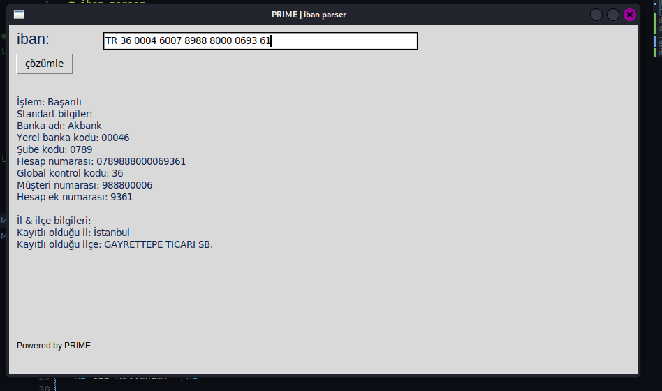

# iban-parser
<p> iban numarası üzerinden bilgi toplamak amaçlıdır</p> 
<p> iban'ın kendisi ile getirmiş olduğu bilgileri</p>
<p> anlaşılır hale getirmektedir.</p>
<p> ÖRNEKLER </p>
</br>
 
</br>
</br>
 
</br>

<h2>Yenilikler: </h2>
<p>- Web kazıma ile otomatik il ilçe bilgisi verme eklendi</p>
<p>- Boşluklar artık sorun değil!</p>
<p>- Daha kolay kullanıma sahip GUI hal hazırlandı </p>
<h2>Kurulum:</h2>

```sh
git clone https://github.com/TheKoba-dev/iban-parser.git
cd iban-parser/
pip install BeautifulSoup argparse requests tkinter #windows
```

```sh
git clone https://github.com/TheKoba-dev/iban-parser.git
cd iban-parser/
python3 -m pip isnstall BeautifulSoup argparse requests tkinter #linux & macos
```
 
 

<h2>CLI Kullanım: </h2>

```sh
python3 offline_iban.py --iban "TR950006200072300006290000" #linux & macos
python offline_iban.py --iban "TR950006200072300006290000" #windows
```
<h2>GUI kullanımı </h2>

```sh
# normal kurulum adımlarından sonra
cd GUI/
python3 iban_gui.py #linux & macos
python iban_gui.py #windows
```

<p>Son güncellenme: 02.04.2022:22.06</p> 
