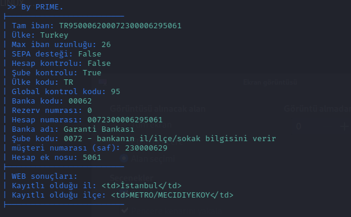

# iban-parser

 iban numarası üzerinden bilgi toplamak amaçlıdır
 

 iban'ın kendisi ile getirmiş olduğu bilgileri

 anlaşılır hale getirmektedir.

 ÖRNEK: 

 
 
 
<h2>Yenilikler: </h2>

- Web kazıma ile otomatik il ilçe bilgisi verme eklendi

- Boşluklar artık sorun değil!

- Web sonuçları daha okunaklı hale geldi! 

<h2> Kullanım: </h2>

python3 offline_iban.py --iban "TR950006200072300006290000"
 

python3 offline_iban.py --iban "TR 950 006 200 072300006290000"

Bu şekilde boşluk ilede kullanılabilir.

